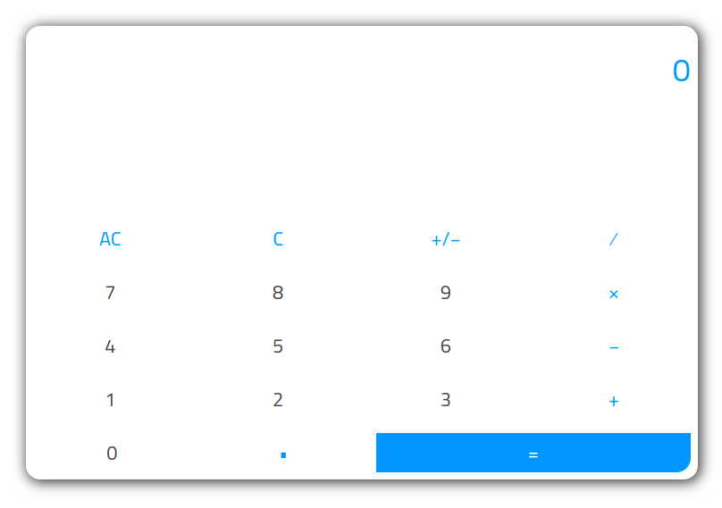

# CriptoDev Calc:

## Link do projeto:

[https://criptodev-calc.vercel.app/]()

## Imagem do projeto:

## Como rodar o projeto localmente?

Após baixar o projeto para máquina local, rode o comando **yarn install**.

Depois da instalação das dependências, rode o projeto em sua máquina com o comando **yarn start** e abra uma aba no seu navegador favorito em [http://localhost:3000](http://localhost:3000).
